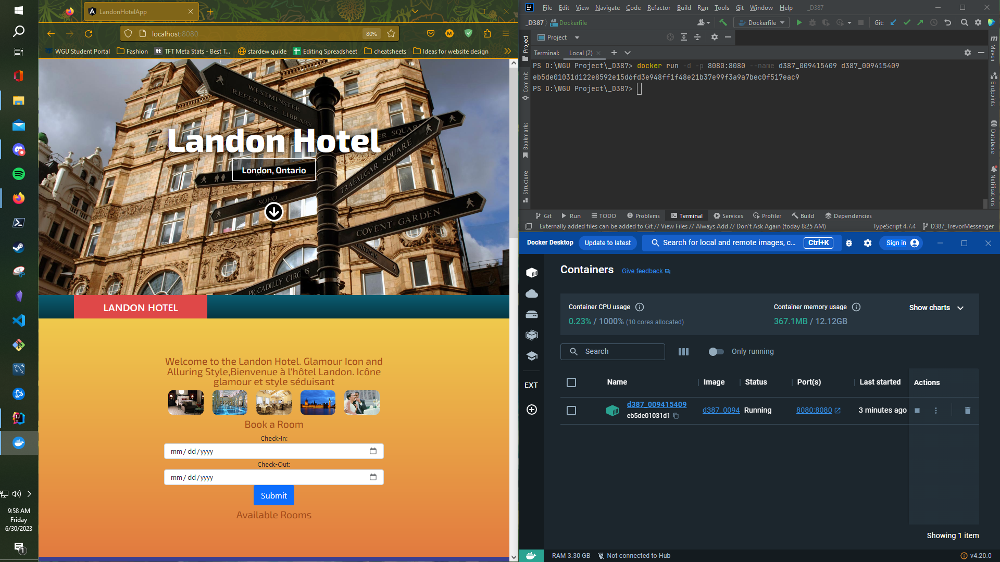

## ** Technologies/Skills Demonstrated: Java, Spring, Docker, Angular, Maven, JPA/Hibernate, H2, multithreading, resource bundling, java date/time api, MVC architecture **

# Spring and Angular Hotel running in Docker: Includes Docker screenshot

This was a full stack application for my university wherein I demonstrate the ability to work with Java, Spring, and Angular full stack applications. 

The frontend was not designed by me and built using a walkthrough supplied by my university, then modified by me to include CRUD functionality, added logic for handling a custom event based of the users time, and displaying backend logic to frontend users. 

I added logic for backend services revolving around REST, resource bundling, multithreading, and the java date/time api.  I was required to launch all resource bundles
concurrently using java threads. Some config files that were supplied by the university have been omitted.

This application is also containerized to be more easily deployed to the cloud using Docker. Below is a screenshot correctly showing the application running in a container and being exposed on port:8080. I built my docker image off an openJDK version.

